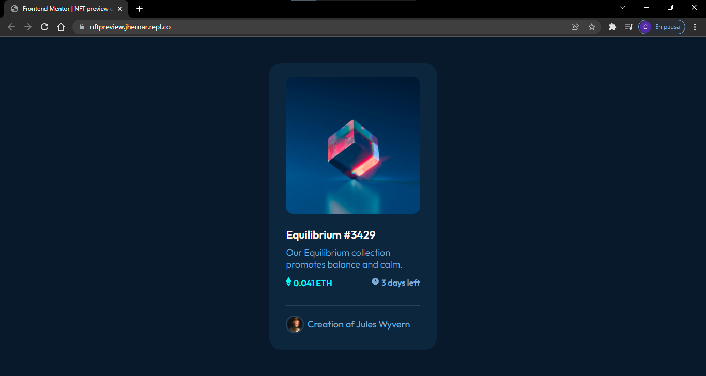

# Frontend Mentor - NFT preview card component solution

This is a solution to the [NFT preview card component challenge on Frontend Mentor](https://www.frontendmentor.io/challenges/nft-preview-card-component-SbdUL_w0U).

## Table of contents

- [Overview](#overview)
  - [The challenge](#the-challenge)
  - [Screenshot](#screenshot)
  - [Links](#links)
- [My process](#my-process)
  - [Built with](#built-with)
  - [What I learned](#what-i-learned)
  - [Continued development](#continued-development)
  - [Useful resources](#useful-resources)
- [Author](#author)
- [Acknowledgments](#acknowledgments)

**Note: Delete this note and update the table of contents based on what sections you keep.**

## Overview

### The challenge

Users should be able to:

- View the optimal layout depending on their device's screen size
- See hover states for interactive elements

### Screenshot

### Links

- Solution URL: [GitHub](https://github.com/jhernar/NFTPreview)
- Live Site URL: [GitHub pages](https://jhernar.github.io/NFTPreview/)

## My process

### Built with

- Semantic HTML5 markup
- CSS custom properties
- Flexbox

### What I learned

### Continued development
I'm  getting practice with flexbox and grid.

### Useful resources

## Author
- Frontend Mentor - [@jhernar](https://www.frontendmentor.io/profile/jhernar)
- Twitter - [@_choysito](https://www.twitter.com/_choysito)

**Note: Delete this note and add/remove/edit lines above based on what links you'd like to share.**

## Acknowledgments

Thank you to my mentor Ubaldo Acosta, you can buy his courses on udemy
- Global Mentoring - [Web](http://www.globalmentoring.com.mx/)
